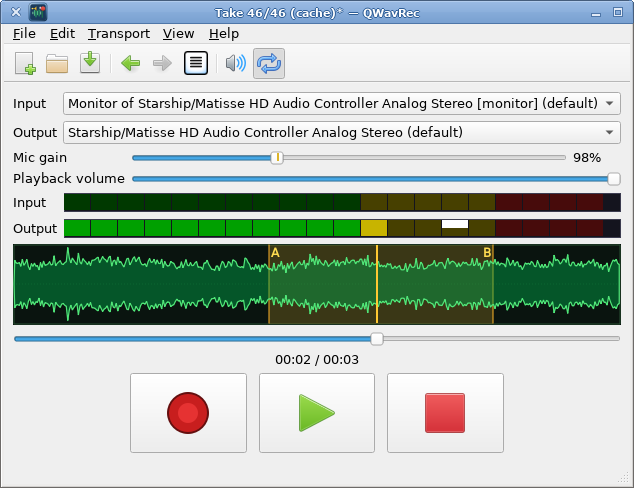

<!--
SPDX-FileCopyrightText: 2026 Ingo Ruhnke <grumbel@gmail.com>
SPDX-License-Identifier: GPL-3.0-or-later
-->

# QWavRec

**Project home:** <https://github.com/Grumbel/qwavrec>

A small, traditional Qt desktop application for playing and recording audio via PipeWire (through Qt Multimedia).



## Workflow

* **Record** toggles recording into an unsaved temporary document.
* **Play** toggles playback / pause of the current document.
* **File → Save / Save As** writes the recording to disk.
* **File → New** discards the current document (with confirmation if modified).
* **Open** loads an existing file as the current document.
* Switch input/output devices on the fly; adjust mic level and playback volume.

No separate Stop button — the Record and Play buttons act as toggles.

## Features

* Device selectors with PulseAudio hot-plug (event-driven)
* LED-style level meters and waveform / spectrogram view
* Old-school colorful SVG icon
* Menu bar + toolbar

## Building

### Nix

```bash
nix build
./result/bin/qwavrec
```

### Manual

Requires Qt 6 (Core, Gui, Widgets, Multimedia) and CMake ≥ 3.16.

```bash
mkdir build && cd build
cmake ..
cmake --build .
./qwavrec
```

## License

GPL-3.0-or-later. See [LICENSES/GPL-3.0-or-later.txt](LICENSES/GPL-3.0-or-later.txt).

This project follows the [REUSE](https://reuse.software/) specification.
